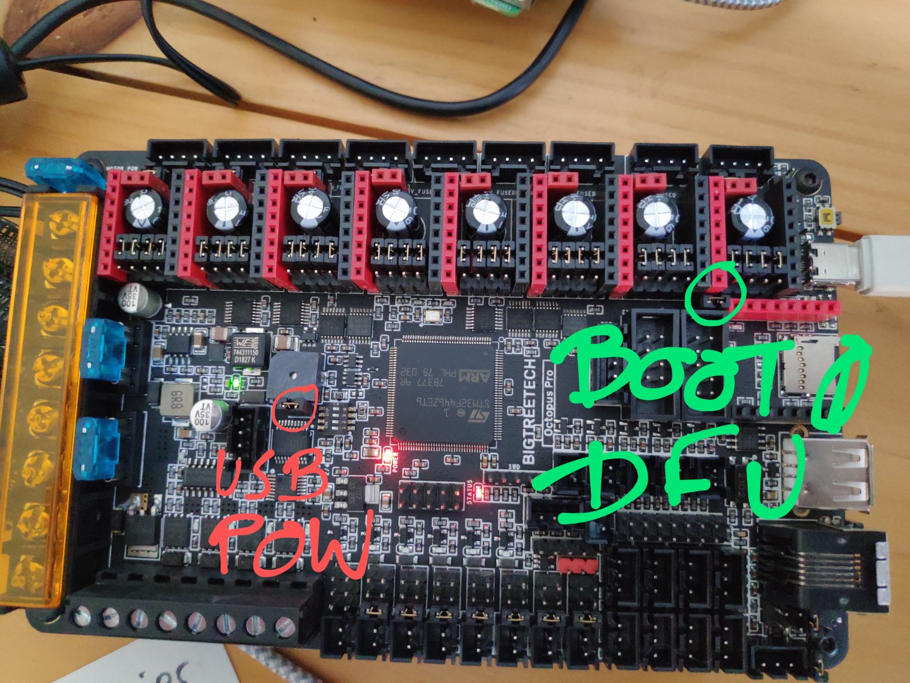

# Settings Up Octopus Pro via USB-Powered (from PI) and DFU Mode  


# Restore factory Octopus STM32F446 bootloader 
> Documentation by Dragonkitty ▞ replimat.eu - Drachenkätzchen#3832

My Octopus F446 wouldn't boot the Klipper CAN Firmware, so I hunted this down to a incompatible bootloader installed by BTT.
Surprisingly, their published bootloader on Github works. Here's how to flash it using dfu-util after putting the
board into DFU boot mode:

```
# Downloads the firmware file in Intel HEX format
wget https://raw.githubusercontent.com/bigtreetech/BIGTREETECH-OCTOPUS-V1.0/master/Firmware/DFU%20Update%20bootloader/bootloader/OctoPus-F446-bootloader-32KB.hex

# Converts the hex firmware to a bin
objcopy --input-target=ihex --output-target=binary OctoPus-F446-bootloader-32KB.hex bootloader.bin

# Optional: Backup the old bootloader
sudo dfu-util -d ,0483:df11 -R -a 0 -s 0x8000000:32768 -U old-bootloader.bin

# Install the new bootloader
sudo dfu-util -d ,0483:df11 -R -a 0 -s 0x8000000:leave -D bootloader.bin
```

Reset bootloader per @Dragonkitty ▞ replimat.eu  pin in CAN Bus stop  if required

# Configure Octopus in USB-Bridge Can bus
> Documentation by Maz | v2.☕ - maz#1337

- Configure [like normal Octopus firmware](https://docs.vorondesign.com/build/software/octopus_klipper.html) except change two the comms port & the can pins (screenshot for F446)
```
cd ~/klipper
make menuconfig
```


- setup CAN0 network 
```
sudo nano /etc/network/interfaces.d/can0
allow-hotplug can0
iface can0 can static
   bitrate 500000
   up ifconfig $IFACE txqueuelen 256
   pre-up ip link set can0 type can bitrate 500000
   pre-up ip link set can0 txqueueln 256
```

- continue setup of upstream devices which will be connected via a RJ11/12 breakout on the octopus